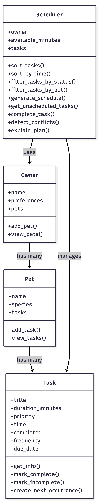
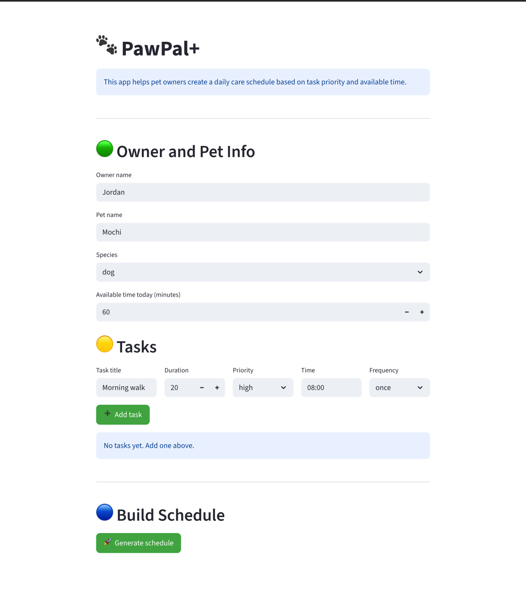

# 🐾 PawPal+ (Module 2 Project)

PawPal+ is a Streamlit app that helps pet owners plan and manage daily pet care tasks in a smart and organized way.

---

## 📌 Scenario

A busy pet owner needs help staying consistent with pet care. PawPal+ acts as an assistant that can:

- Track pet care tasks (walks, feeding, meds, grooming, etc.)
- Consider constraints (available time, priority, preferences)
- Generate a daily plan
- Explain why tasks were selected

---

## 🚀 Features

- Task scheduling based on priority and available time  
- Sorting tasks by **time, priority, and duration**  
- Filtering tasks by **pet** and **completion status**  
- Marking tasks as **complete or incomplete**  
- Recurring tasks (**daily / weekly**) with automatic next occurrence  
- Conflict detection for tasks scheduled at the same time  
- Clear schedule explanation  
- Interactive Streamlit UI  
- Automated testing using `pytest`  
- Suggests next available time slot when a conflict occurs

## 🧩 System Architecture (UML)


---

## 🛠️ How to Run the App

### Setup

```bash
python -m venv .venv
source .venv/bin/activate   # Windows: .venv\Scripts\activate
pip install -r requirements.txt
```

---
## 📸 Demo

## 

<a href="" target="_blank">
  
</a>